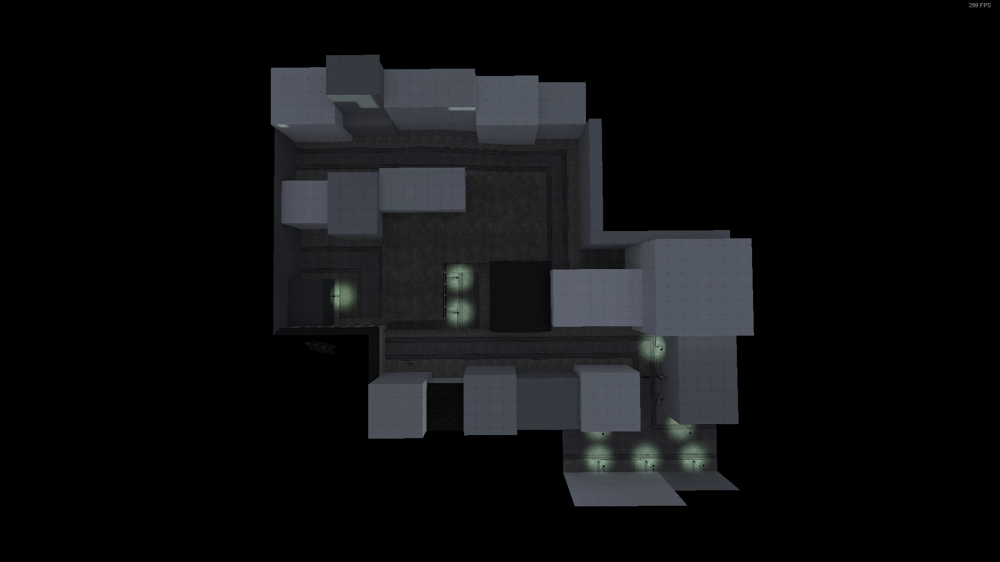
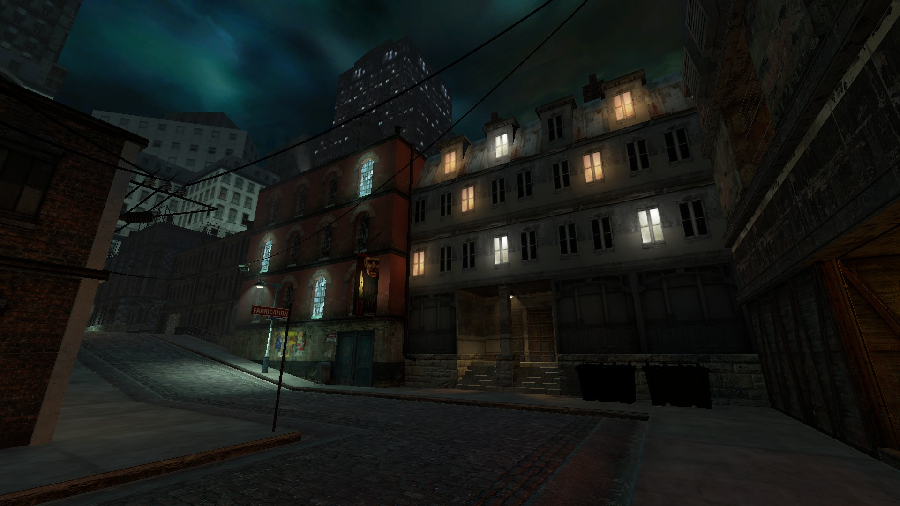

# GM_BETAC17

I released this level for Garry's Mod in September 2018 after working on it on
and off for about 3 years. I built it as a love letter to all of the unused
development concepts and art from [Half-Life 2](https://store.steampowered.com/app/220/HalfLife_2/).
The first prototype was made in May 2015 and was built from actual level scraps
taken from those early iterations of Half-Life 2.

*A video of the level from May 2015 after only two days of development.*

Around this time I was doing a lot of research and tinkering with an early
build of Half-Life 2, originally leaked in 2003 but containing development
assets from as far back as 2000. Many early concepts for Half-Life 2's story
had a much darker, more grim tone compared to the tone of the final game. This
heavily influenced my direction while working on this level over the next few
years.

*Greybox version of the map from August 2016*

Starting in August 2016 I rebuilt the level from scratch entirely with my own
geometry and layout. This was one of my first experiences in greyboxing and
designing things layout-first. I had no prior training or experience before
this, and it taught me a lot about how to design levels for videogames from
scratch instead of relying on other people's work.

*A video of the level from August 2016 showing a rough scripted sequence outline*

It was never really intended for any kind of gameplay, just an atmospheric art
piece that you could walk around in the Source Engine. Though I did experiment
with a made up story scenario that involved an NPC guiding the player through
the environment while delivering spoken exposition.

*One area that did not make the final cut.*

*The final version of the level, as released in September 2018*

After doing the initial greybox and some limited artpassing, the level
languished on the backburner for a while as I worked on other projects and went
into my final year of High School. In September 2018 I decided to try and
finish up the level and release it on the Steam Workshop for Garry's Mod. It
was finished and released that same month.
